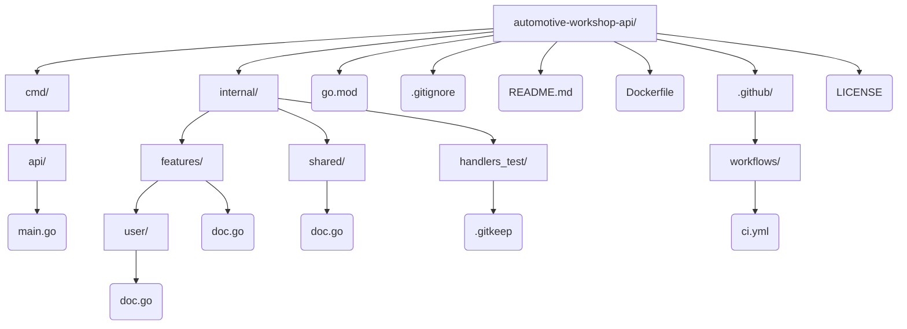

# automotive-workshop-api

API Go gerada automaticamente.

```bash
go run ./cmd/api
```

## Stack

**Go REST API** — API Go com layout padrao cmd/ + internal/ (handlers/models/services).

## Arquitetura

**Vertical Slice (Feature-based)** — Organizado por funcionalidade; cada feature reune suas proprias camadas.

## Estrutura do projeto


