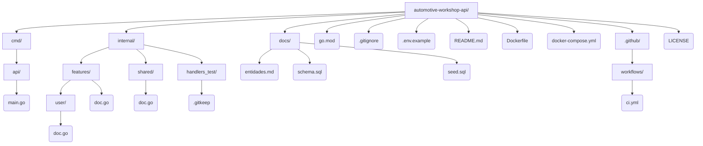

# automotive-workshop-api

```bash
go run ./cmd/api
```

## Stack

**Go REST API** — API Go com layout padrao cmd/ + internal/ (handlers/models/services).

## Arquitetura

**Vertical Slice (Feature-based)** — Organizado por funcionalidade; cada feature reune suas proprias camadas.

## Banco de dados

O modelo de dados está documentado em [docs/entidades.md](docs/entidades.md) e o schema PostgreSQL correspondente (tabelas, enums, índices e comentários) em [docs/schema.sql](docs/schema.sql).

Suba o banco (Postgres + Adminer + API) com Docker Compose:

```bash
cp .env.example .env
docker compose up -d
```

- **Postgres**: `localhost:5432` (credenciais em `.env`), com `docs/schema.sql` aplicado automaticamente na primeira subida.
- **Adminer**: http://localhost:8081 — sistema `PostgreSQL`, servidor `db`, usuário/senha/banco conforme `.env`.
- **API**: http://localhost:8080/health

Para recriar o banco do zero (ex: após alterar `schema.sql`), como o script só roda na criação inicial do volume:

```bash
docker compose down -v
docker compose up -d
```

### Dados de exemplo (seed)

[docs/seed.sql](docs/seed.sql) popula o banco com clientes, veículos, produtos, serviços e ordens de serviço cobrindo os principais status do fluxo. Usa IDs fixos com `ON CONFLICT DO NOTHING`, então pode ser reexecutado sem duplicar dados.

PowerShell (Windows):

```powershell
Get-Content docs/seed.sql -Raw | docker compose exec -T db psql -U workshop -d automotive_workshop
```

Bash/Git Bash/macOS/Linux:

```bash
docker compose exec -T db psql -U workshop -d automotive_workshop < docs/seed.sql
```

## Estrutura do projeto


