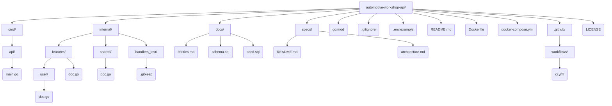

# automotive-workshop-api

```bash
go run ./cmd/api
```

## Stack

**Go REST API** — Go API with the standard cmd/ + internal/ layout (handlers/models/services).

## Architecture

**Vertical Slice (Feature-based)** — Organized by functionality; each feature gathers its own layers.

## Database

The data model is documented in [docs/entities.md](docs/entities.md) and the corresponding PostgreSQL schema (tables, enums, indexes, and comments) in [docs/schema.sql](docs/schema.sql).

Bring up the database (Postgres + Adminer + API) with Docker Compose:

```bash
cp .env.example .env
docker compose up -d
```

- **Postgres**: `localhost:5432` (credentials in `.env`), with `docs/schema.sql` applied automatically on first startup.
- **Adminer**: http://localhost:8081 — system `PostgreSQL`, server `db`, user/password/database as in `.env`.
- **API**: http://localhost:8080/health

To recreate the database from scratch (e.g. after changing `schema.sql`), since the script only runs on initial volume creation:

```bash
docker compose down -v
docker compose up -d
```

### Sample data (seed)

[docs/seed.sql](docs/seed.sql) populates the database with customers, vehicles, products, services, and service orders covering the main statuses of the flow. It uses fixed IDs with `ON CONFLICT DO NOTHING`, so it can be re-run without duplicating data.

Apply it by copying the file into the container before running (avoids UTF-8 encoding issues that occur when using pipe/redirection from stdin on PowerShell):

```bash
docker compose cp docs/seed.sql db:/tmp/seed.sql
docker compose exec db psql -U workshop -d automotive_workshop -f /tmp/seed.sql
```

Works the same way on PowerShell, Bash, Git Bash, macOS, and Linux.

## Project structure


